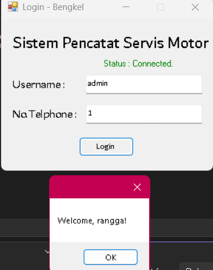
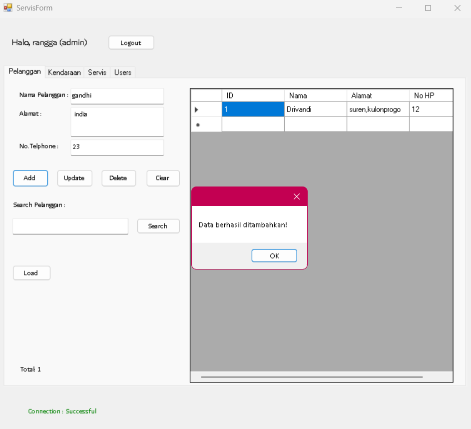
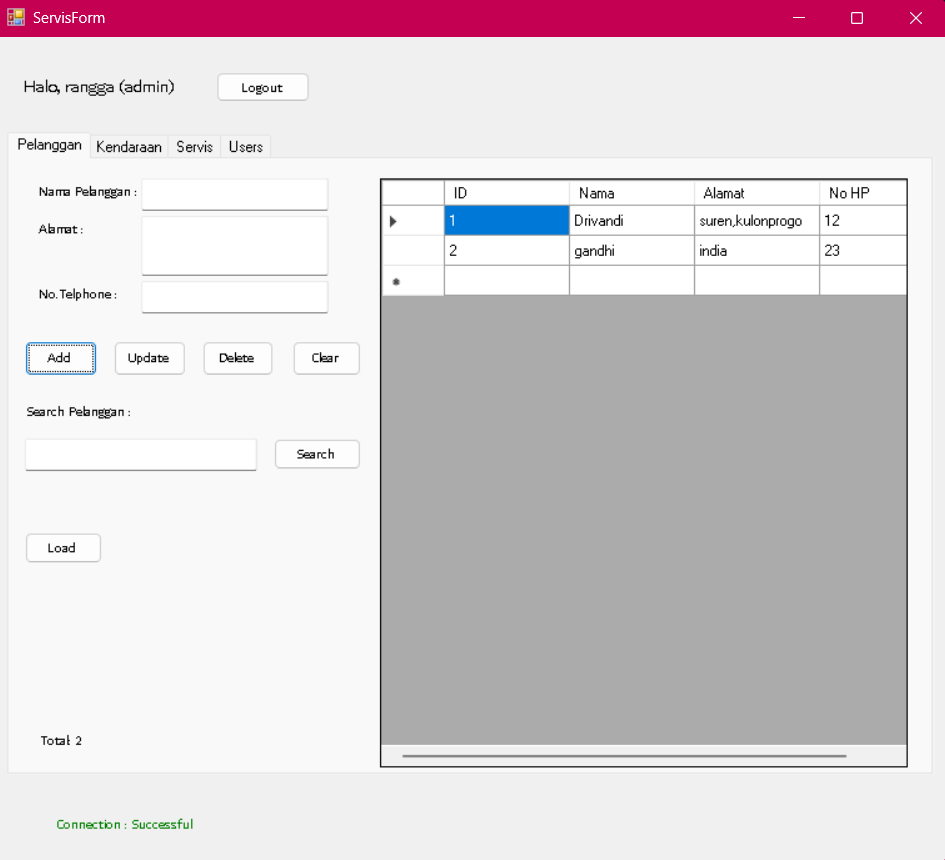
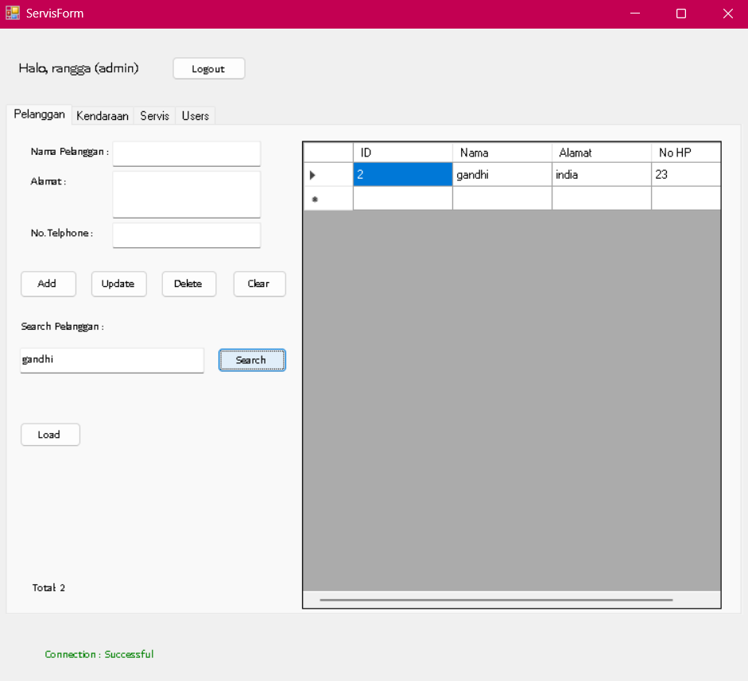

# 🛠️ Sistem Pencatat Servis Motor (Bengkel)

Sistem Informasi berbasis Desktop untuk mengelola data operasional bengkel motor, mulai dari manajemen pelanggan, kendaraan, hingga pencatatan transaksi servis dan cetak nota.

> **Status**: UCP 1 ✅ + UCP 2 ✅ — Trio Isekai (Farhan, Rangga, Fadil)

---

## 🌟 Fitur Utama

- **🔑 Sistem Login & Keamanan**
  - Login menggunakan Username dan Nomor Telepon
  - Role-based Access: **Admin** (Full CRUD) vs **Petugas** (CRU only, tidak dapat Delete)
  - Petugas hanya read-only pada tabel Users (mencegah privilege escalation)
- **📋 Manajemen Pelanggan**: Input, Update, Delete, Cari data pelanggan
- **🏍️ Manajemen Kendaraan**: Pencatatan data kendaraan terhubung dengan pemilik (`ON DELETE CASCADE`)
- **🔧 Pencatatan Servis**:
  - Riwayat servis lengkap (Tanggal, Jenis Servis, Suku Cadang, Biaya, Catatan)
  - Integrasi pemilihan Kendaraan dan Petugas via ComboBox
  - **🖨️ Cetak Nota**: Print preview untuk nota servis
- **👥 Manajemen User**: Kelola petugas (admin only)
- **📊 Dashboard Interaktif**:
  - Navigasi antar modul dengan Tab Control
  - Pencarian data dengan update real-time
  - Total data counter di setiap modul
  - **BindingNavigator** untuk navigasi record (First / Prev / Next / Last)

---

## 🚀 Teknologi yang Digunakan

- **Language**: C# (.NET Framework 4.7.2)
- **Framework**: Windows Forms
- **Database**: Microsoft SQL Server
- **ORM/Connector**: ADO.NET (SqlConnection, SqlCommand, SqlDataReader, SqlDataAdapter)
- **UI Components**: DataGridView, BindingSource, BindingNavigator, TabControl
- **Printing**: `System.Drawing.Printing` (PrintDocument + PrintPreviewDialog)

---

## 📂 Struktur Proyek

```
SistemServisMotor/
├── Form1.cs              ← Halaman Login (+ SQL Injection demo untuk UCP 2)
├── Form2.cs              ← MainForm dengan 4 Tab (Pelanggan, Kendaraan, Servis, Users)
├── DatabaseHelper.cs     ← Helper koneksi database
├── App.config            ← Konfigurasi aplikasi
└── Query Bengkel Fixed(2).sql  ← Setup database: tabel, role, View, Stored Procedure
```

---

## 🆕 Fitur UCP 2

### 1. 📦 Stored Procedure (Insert / Update / Delete / Search)

Semua operasi CUD + Search menggunakan **Stored Procedure** yang dilengkapi **logika bisnis tambahan** (bukan sekadar wrapper query dasar):

| Stored Procedure | Logika Tambahan |
|------------------|-----------------|
| `sp_InsertPelanggan` | Cek duplikat No HP (RAISERROR jika sudah ada) |
| `sp_UpdatePelanggan` | Validasi record exist sebelum update |
| `sp_DeletePelanggan` | Validasi record exist (CASCADE menjalar ke Kendaraan & Servis) |
| `sp_SearchPelanggan` | LIKE search di kolom `nama` + RAISERROR jika 0 hasil |
| `sp_InsertKendaraan` | Cek duplikat plat_no + cek pelanggan exist |
| `sp_UpdateKendaraan` | Validasi pelanggan exist sebelum update |
| `sp_DeleteKendaraan` | Validasi record exist (CASCADE ke Servis) |
| `sp_SearchKendaraan` | Multi-field search (plat_no / merk) |
| `sp_InsertUser` | Cek duplikat username (RAISERROR jika sudah ada) |
| `sp_UpdateUser` | Validasi record exist |
| `sp_DeleteUser` | Validasi record exist (SET NULL pada id_user di Servis) |
| `sp_SearchUser` | Multi-field search (nama / username) |
| **`sp_InsertServis`** | **Validasi kendaraan & user exist + TRANSACTION + TRY/CATCH + OUTPUT parameter `@new_id`** |
| **`sp_UpdateServis`** | **Validasi 3 entity + TRANSACTION + TRY/CATCH** |
| `sp_DeleteServis` | Validasi record exist |
| `sp_SearchServis` | Multi-field search (plat_no / jenis servis / nama petugas) |

### 2. 🪟 View (SELECT)

Semua query tampil data menggunakan **VIEW** (4 buah):

| View | Isi |
|------|-----|
| `vwPelanggan` | Wrapper untuk tabel Pelanggan |
| `vwKendaraan` | JOIN Kendaraan + Pelanggan (denormalized — tampilkan nama pelanggan langsung) |
| `vwUsers` | Wrapper untuk tabel Users |
| `vwServis` | JOIN Servis + Kendaraan + Users (denormalized — tampilkan plat_no & nama petugas) |

Aplikasi mengakses VIEW via SP `sp_GetAllXxx`.

### 3. 🪝 BindingSource untuk DataGridView

Setiap DataGridView dibinding ke `BindingSource` sebagai perantara data:

```csharp
BindingSource bsPelanggan = new BindingSource();
bsPelanggan.DataSource = dt;       // dt dari SqlDataAdapter / SqlDataReader
dgvPelanggan.DataSource = bsPelanggan;
```

### 4. 🧭 BindingNavigator

Setiap tab punya `BindingNavigator` (dock bottom) untuk navigasi record:

```
|◄  ◄  [ 1 of 5 ]  ►  ►|
```

Saat user pencet panah, event `PositionChanged` fire → textbox + combobox otomatis terisi data row aktif. Klik baris di DGV juga otomatis trigger flow yang sama (via BindingSource sync).

### 5. 🐛 SQL Injection Demo

Salah satu form (**Login**) sengaja dibuat rentan SQL Injection untuk demonstrasi edukatif. Detail skenario di bawah.

---

## 🐛 Skenario SQL Injection

> ⚠️ **Disclaimer**: Kerentanan ini **disengaja** untuk keperluan demonstrasi UCP 2. Pada aplikasi produksi nyata, **WAJIB** menggunakan parameterized query.

### 🎯 Form yang Rentan: Login Form (`Form1.cs`)

#### Kode Vulnerable

```csharp
// Field username sengaja pakai konkatenasi string (TIDAK AMAN)
string sql = "SELECT id_user, nama, role FROM Users"
           + " WHERE username='" + txtusername.Text + "'"
           + " AND no_telp=@t";

using (SqlCommand cmd = new SqlCommand(sql, conn))
{
    cmd.Parameters.Add(new SqlParameter("@t", txttele.Text.Trim()));
    // ...
}
```

#### Mengapa Rentan?

Input `txtusername.Text` langsung digabung ke string query tanpa sanitasi. Penyerang dapat menyuntikkan karakter SQL khusus untuk mengubah struktur query yang dieksekusi server.

> **Catatan**: Field `no_telp` tetap di-parameterize (`@t`), sebagai contrast untuk menunjukkan field mana yang aman vs rentan.

---

### 🎬 Skenario 1: Authentication Bypass

**Tujuan**: Login tanpa mengetahui kredensial yang valid.

| Field | Input |
|-------|-------|
| Username | `' OR '1'='1' --` |
| No. Telp | `000` (bebas) |

**Query yang terbentuk di SQL Server:**

```sql
SELECT id_user, nama, role FROM Users
WHERE username='' OR '1'='1' --' AND no_telp='000'
```

**Penjelasan:**
- `--` adalah komentar di SQL → bagian `AND no_telp='000'` diabaikan
- `'1'='1'` selalu TRUE → query mengembalikan SEMUA user
- Aplikasi membaca baris pertama dengan `reader.Read()` → login **berhasil**

**Hasil**: 🚨 Berhasil login sebagai user pertama tanpa mengetahui kredensial.

---

### 🎬 Skenario 2: Login Paksa sebagai Admin

**Tujuan**: Mendapatkan akses dengan role admin secara paksa.

| Field | Input |
|-------|-------|
| Username | `' OR role='admin' --` |
| No. Telp | `000` |

**Query yang terbentuk:**

```sql
SELECT id_user, nama, role FROM Users
WHERE username='' OR role='admin' --' AND no_telp='000'
```

**Hasil**: 🚨 Berhasil login sebagai user pertama dengan role `admin` — dapat melakukan operasi DELETE dan mengelola Users.

---

### 🎬 Skenario 3: UNION-Based Data Extraction

**Tujuan**: Mengekstrak data sensitif (username & no_telp) seluruh user.

| Field | Input |
|-------|-------|
| Username | `' UNION SELECT id_user, username, no_telp FROM Users --` |
| No. Telp | `000` |

**Query yang terbentuk:**

```sql
SELECT id_user, nama, role FROM Users
WHERE username=''
UNION SELECT id_user, username, no_telp FROM Users --' AND no_telp='000'
```

**Hasil**: 🚨 Result set berisi data username dan no_telp seluruh user — seluruh kredensial bocor.

---

### 🛡️ Cara Pencegahan SQL Injection

Selalu gunakan **parameterized query** seperti yang diterapkan di semua form lain pada aplikasi ini:

```csharp
// ✅ AMAN — pakai SqlParameter
string sql = "SELECT id_user, nama, role FROM Users WHERE username=@u AND no_telp=@t";
using (SqlCommand cmd = new SqlCommand(sql, conn))
{
    cmd.Parameters.Add(new SqlParameter("@u", txtusername.Text.Trim()));
    cmd.Parameters.Add(new SqlParameter("@t", txttele.Text.Trim()));
    // ...
}
```

Dengan parameterized query:
- Input pengguna diperlakukan sebagai **data literal**, bukan bagian struktur SQL
- Karakter spesial (`'`, `--`, dll) tidak akan diinterpretasikan sebagai sintaks SQL
- Injeksi tidak akan berdampak

---

## 🛠️ Cara Menjalankan

### 1. Setup Database

a. Pastikan **SQL Server** berjalan dan **SSMS** terinstal.

b. Buka **`Query Bengkel Fixed(2).sql`** di SSMS, jalankan **dari awal sampai akhir** (akan otomatis create database, tabel, role, view, dan stored procedure).

c. (Opsional) Insert data dummy:

```sql
USE DBBengkel;

INSERT INTO Users(nama, username, no_telp, role) VALUES
('Farhan Rasyid M.',     'farhan',  '081234567890', 'admin'),
('Rangga Alfarizzy',     'rangga',  '082345678901', 'petugas'),
('A. Muh. Fadil Asytar', 'fadil',   '083456789012', 'petugas');

INSERT INTO Pelanggan(nama, alamat, no_hp) VALUES
('Budi Santoso', 'Jl. Mawar No. 12, Yogyakarta', '085111222333'),
('Siti Aminah',  'Jl. Melati No. 7, Sleman',     '085444555666'),
('Joko Widodo',  'Jl. Kenanga No. 21, Bantul',   '085777888999');

INSERT INTO Kendaraan(id_pelanggan, merk, plat_no, tahun) VALUES
(1, 'Honda Beat',    'AB1234XY', 2020),
(2, 'Yamaha NMax',   'AB5678ZZ', 2022),
(3, 'Suzuki Satria', 'AB9012AB', 2019);

INSERT INTO Servis(id_kendaraan, id_user, Tanggal, JenisServis, SukuCadang, Biaya, Catatan) VALUES
(1, 1, '2026-05-01', 'Ganti Oli',     'Oli Yamalube 1L',          55000,  'Servis rutin'),
(2, 2, '2026-05-05', 'Ganti Ban',     'Ban IRC 80/90-14',         320000, 'Ban depan aus'),
(3, 3, '2026-05-10', 'Tune Up Mesin', 'Busi Denso, Filter Udara', 150000, NULL);
```

### 2. Setup Aplikasi

a. Buka `SistemServisMotor.sln` dengan **Visual Studio 2019+**.

b. Sesuaikan connection string di `DatabaseHelper.cs` dengan nama SQL Server instance kamu:

```csharp
static string connstr = "Data Source=YOUR_SERVER\\YOUR_INSTANCE;Initial Catalog=DBBengkel;Integrated Security=True";
```

c. Build & Run (F5).

### 3. Login

| Username | No. Telp | Role |
|----------|----------|------|
| `farhan` | `081234567890` | admin |
| `rangga` | `082345678901` | petugas |
| `fadil`  | `083456789012` | petugas |

**Untuk demo SQL Injection**, gunakan:
- Username: `' OR '1'='1' --`
- No. Telp: `000`

---

## 👥 Pembagian Role

| Operasi | Admin | Petugas |
|---------|-------|---------|
| Login / Logout | ✅ | ✅ |
| Kelola Pelanggan (Add/View/Update) | ✅ | ✅ |
| Hapus Pelanggan | ✅ | ❌ |
| Kelola Kendaraan (Add/View/Update) | ✅ | ✅ |
| Hapus Kendaraan | ✅ | ❌ |
| Kelola Servis (Add/View/Update) | ✅ | ✅ |
| Hapus Servis | ✅ | ❌ |
| Cetak Nota Servis | ✅ | ✅ |
| Lihat Users | ✅ | ✅ (read-only) |
| Tambah/Ubah/Hapus Users | ✅ | ❌ |

**Pembedaan diterapkan di 2 layer (defense in depth):**
1. **Database level**: `GRANT/DENY` pada role `role_admin` dan `role_petugas`
2. **UI level**: Tombol disembunyikan bagi Petugas

---

## 📸 Dokumentasi Screenshot

### 1. Form Koneksi & Login
*Menampilkan status koneksi database saat aplikasi dijalankan dan halaman autentikasi.*


### 2. Form Input Data
*Proses pengisian data pada modul Pelanggan, Kendaraan, atau Servis.*


### 3. Form Tampilan Data
*Tampilan DataGridView yang menampilkan seluruh record dari database.*


### 4. Bukti Operasi CRUD & Search
*Dokumentasi hasil setelah melakukan Insert, Update, Delete, maupun fitur pencarian.*


---

## 📚 Referensi Kriteria UCP

### UCP 1 — Pengenalan ADO.NET & CRUD

| Bagian | Implementasi |
|--------|--------------|
| A | `SqlConnection`, `SqlCommand`, `SqlDataReader`, `SqlDataAdapter` |
| B | Status koneksi sebelum form utama (LoginForm_Load) |
| D | INSERT/UPDATE/DELETE + `ExecuteNonQuery` + `ExecuteScalar` untuk count |
| E | Tampilkan Data, Search, DGV → TextBox |
| F | Validasi input + konfirmasi delete/update |

### UCP 2 — Lanjutan

| # | Kriteria | Implementasi |
|---|----------|--------------|
| 1 | Stored Procedure (tidak sekadar query dasar) | 16 SP dengan validasi, transaction, OUTPUT parameter |
| 2 | View untuk SELECT | 4 VIEW (denormalized) |
| 3 | SQL Injection demo + skenario di README | Login Form + 3 skenario di README ini |
| 4 | BindingSource untuk DataGridView | 4 BindingSource (1 per tab) |
| 5 | BindingNavigator untuk pilih data DGV | 4 BindingNavigator dari Designer + `PositionChanged` event |

---

## 👨‍💻 Tim Pengembang

**Trio Isekai**
- Farhan Rasyid M. — 20240140102
- Rangga Alfarizzy — 20240140059
- A. Muh. Fadil Asytar — 20240140133

---

*Dibuat untuk UCP 1 & UCP 2 Praktikum Basis Data — SMT 4 TI UMY 2026*
